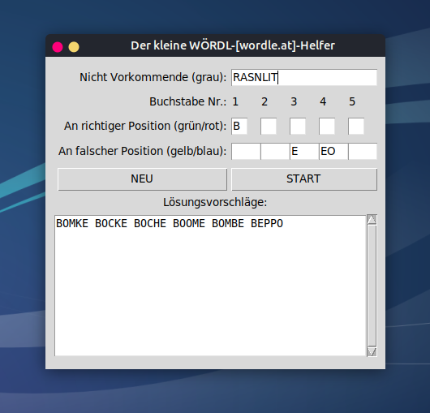

# Der kleine WÖRDL-Helfer

Diese kleine Python3-Tk-Applikation hilft beim Finden von möglichen Lösungen von [WÖRDL-Rätseln](https://wordle.at/), z. B. auf [https://wordle.at](https://wordle.at/) (deutsche [Wordle](https://de.wikipedia.org/wiki/Wordle)-Rätsel mit Ä=AE, Ö=OE, Ü=UE und ß=SS).

Die Installation erfolgt in einem Verzeichnis Ihrer Wahl. Voraussetzung ist ein installiertes [Python](https://www.python.org/) 3.8+ inkl. [tkinter](https://docs.python.org/3/library/tkinter.html). 

Starten Sie die Applikation mit

		python3 main.py

Geben Sie alle grauen (nicht vorkommenden) Buchstaben, die bereits bekannten grünen oder roten Buchstaben der Lösung und die gelben oder blauen Buchstaben, die an falscher Position sind, ein.

Klicken Sie *START* oder drücken Sie einfach die *ENTER*-Taste.

Es werden Ihnen mögliche Lösungen in absteigender Wahrscheinlichkeit angezeigt.

Viel Spaß mit dem kleinen *WÖRDL-Helfer*.

---

# The little WÖRDL helper

This small Python3-Tk application helps to find possible solutions of [WÖRDL puzzles](https://wordle.at/), e.g. on [https://wordle.at](https://wordle.at/) (German [Wordle](https://en.wikipedia.org/wiki/Wordle) puzzles with Ä=AE, Ö =OE, Ü=UE and ß=SS).

The installation takes place in a directory of your choice. An installed [Python](https://www.python.org/) 3.8+ with [tkinter](https://docs.python.org/3/library/tkinter.html) is required.

Start the application with

		python3 main.py

Enter all the gray (non-existent) letters, the green or red letters of the solution you already know, and the yellow or blue letters that are in the wrong position.

Click *START* or simply press the *ENTER* key.

Possible solutions are displayed in descending order of probability.

Have fun with the little *WÖRDL helper*.

-----

### Security Notice

The code I released here into the public domain may appear in third-party projects. I do not maintain, endorse, or have any affiliation with such projects. Any malicious or deceptive use is unauthorized and should be reported to the hosting platform.

-----